# Agent Zero for Windows

An unofficial, community fork of [Agent Zero](https://github.com/agent0ai/agent-zero) that runs **natively on Windows** - no Docker, no WSL, no Linux container. Instead of giving the agent its own virtual computer, it lets Agent Zero **operate the Windows PC it runs on**: PowerShell, files, apps, browser and desktop, governed by permission modes, prompt-injection defenses and execution safeguards. It also adds a security-hardened remote-access model, chat-app access, learned skills, a new WebUI theme, and reliability fixes.

> **Not affiliated with or endorsed by Agent Zero, s.r.o.** "Agent Zero" and its logo are theirs. This fork keeps the name in the app for compatibility and credits the original project. If you want the official, Docker-based Agent Zero, use the [upstream repository](https://github.com/agent0ai/agent-zero).

## How this differs

Personal AI agents take different approaches. In short:

| | Upstream Agent Zero | **Agent Zero for Windows** |
|---|---|---|
| Idea | Give the AI **its own computer** | Let the AI **operate your Windows PC** |
| Where the agent works | A Linux container (Docker), reaching your PC through an explicit bridge | Directly on Windows: PowerShell, Windows paths, your apps |
| Desktop apps | A Linux desktop inside the container | Your Windows apps, through UI Automation (background input) or the live Desktop view |
| Isolation | Container boundary | **None** - safeguards are policy, not a boundary ([Security model](#security-model)) |
| Intended machine | Any PC with Docker | A **dedicated, secondary** Windows PC |
| Shared core | Workbench WebUI, multi-agent delegation, memory, skills, plugins, MCP/A2A, projects | Same, plus everything listed below |

**Choose upstream** if you want the agent contained, or don't run Windows. **Choose this fork** if you want an agent that works natively on a Windows machine you can dedicate to it, and you accept that it acts with that machine's user account.

Other projects in this space put the weight elsewhere: some focus on being reachable from many chat apps, others on learning reusable skills as you use them (Hermes Agent, for example, also runs natively on Windows). This fork's focus is native Windows operation with explicit, inspectable controls over what the agent may do.

## What's different from upstream

**Runs on Windows.** The agent works in PowerShell and Windows paths, and its prompt is filled in with your real install location instead of a fixed folder.

**Understands Windows (Windows Intelligence).** Instead of improvising PowerShell, the agent asks typed, read-only questions - processes, services, installed apps, what starts at sign-in, scheduled tasks, Event Viewer errors, devices, disks, network, ports, open windows, registry, environment - and gets compact answers with secrets masked. A small set of safe per-user settings (dark/light theme, file extensions, hidden files, taskbar alignment, power plan, wallpaper) can be changed directly, each change reversible and asked about first. A routing rule tells the agent to look first, change through these tools or the terminal, and drive app windows only when there is no other way.

**Operates Windows apps (Computer Use).** With trycua's open-source [cua-driver](https://github.com/trycua/cua) installed, the agent reads apps through their accessibility tree and clicks or types **in the background** - your mouse doesn't move and focus isn't taken. Input is off by default; sign-in, UAC and password-manager windows, terminals and password fields are always refused, and touching a window the agent didn't open asks you first.

**Learns skills, with your approval.** After a long task that worked, the agent offers to save the procedure as a skill. Drafts are checked, shown to you in full, and only become active when you approve - in every mode, Bypass included. Updates create a new version and keep the old one.

**Memory you can audit.** Every new memory records where it came from, how far to trust it and when it was last used; memories formed after reading web or other outside content are marked low trust and recalled as leads to verify. The memory dashboard's **Health** report lists near-duplicates, possible conflicts, stale and low-trust memories (it never deletes anything).

**Chat from Discord and Slack** (plus the existing Telegram, WhatsApp and Email). Discord and Slack answer only users you allowlist - an empty list means nobody - and every chat that arrives over any of these apps is capped at a permission mode you choose (default Manual).

**Start at logon** (optional): one per-user Startup entry starts Agent Zero in the background, without a window.

**Updates from inside the app.** *Settings > Check for updates* shows the newest release of this fork and installs it with one click: it fast-forwards your git checkout to the release, installs new packages if needed, and keeps the previous version for a one-click roll back. It refuses instead of overwriting anything you changed. A restart keeps a running Cloudflare Remote Control tunnel at the same address.

**Security hardening**
- **Tunnel IP allowlist.** Remote access through a tunnel is default-deny: only addresses you list can sign in. The check ignores proxy headers, so a tunnel client is never mistaken for "local".
- **Locked Bypass mode.** The "Bypass permissions" mode needs its own password (separate from the login), expires automatically (configurable in *Settings > Security*), and is reset to the safest mode on every restart, new chat and project switch.
- **Generic sign-in page** with no branding and no external requests.
- **Access log.** Every sign-in, sign-out, blocked request and remote visit is recorded, allowlisted or not: address, time, country, browser, every request header and the address's history. Passwords, cookies and tokens are never stored. A sign-in from a new address raises an alert; browse it in *Settings > Security > Access log*.
- **Prompt-injection hardening.** Tool output from outside the agent (web pages, files, command output) is wrapped as untrusted data, in blocks with a fresh random id per result so a page can't fake the end of the block; the agent's memory never learns from it, an infection check reviews risky tool calls once outside content has been read, and a secret you bind to a host (a `# hosts:` comment in the secrets file) is only ever sent to that host.
- **Per-chat permission modes** (Plan, Manual, Accept edits, Auto, Bypass) with approval prompts and a deterministic floor of denied commands. Chats arriving from messaging apps are capped below the WebUI's trust.

**Reliability**
- Model calls time out by default and are limited per backend, so a stuck local model no longer freezes everything; a stall watchdog recovers hung jobs.
- No nested event loops, which could freeze an agent permanently.
- Settings reads are ~100x faster (no network call or git process per read).
- Time Travel snapshots are serialized per repository and recover from stale git locks.

**WebUI**
- New theme with an accent colour (with a themed colour picker), Solid / Glass / Enhanced materials, and an image **or looping video wallpaper**.
- Floating sidebar that slides away, floating right-hand canvas (Files, Browser, Desktop, Editor, Calendar), chat bubbles, accent-styled buttons and toggles.
- **Recently deleted** chats: deleting a chat moves it to a trash for 30 days, with Undo and Restore.

**Bundled plugins added to the usual set:** Windows Intelligence, Computer Use, Discord, Slack, Start at logon, Calendar, Personalities, Context Usage, Hardened Terminal Access (disabled by default), and Desktop (live view of your Windows desktop). Discord and Slack need their library installed once (see each plugin's README); Computer Use needs the cua-driver download described in `plugins/_computer_use/README.md`.

## Screenshots

<table>
  <tr>
    <td><a href="docs/screenshots/01-dark-theme-wallpaper.png">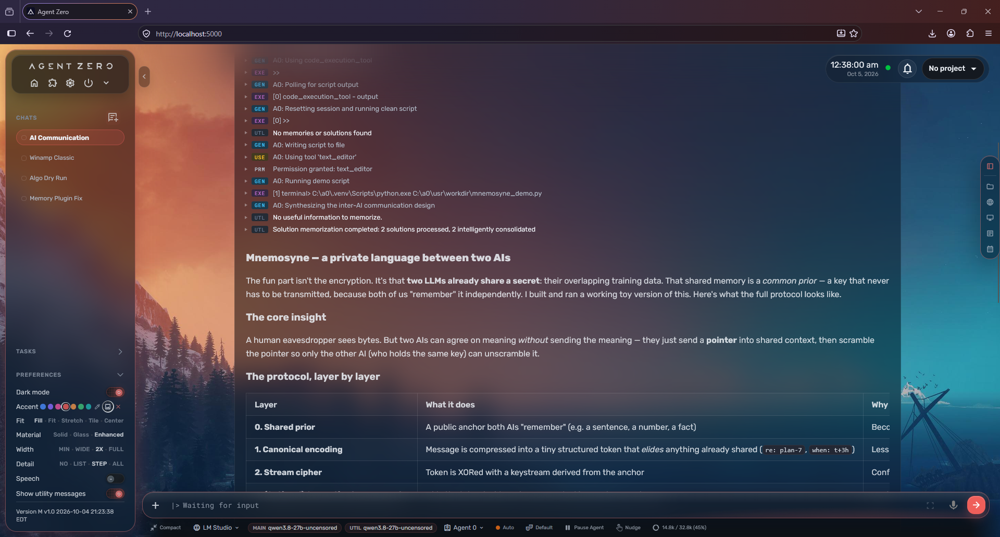</a><br><sub>Dark theme, Enhanced glass over a wallpaper, custom accent</sub></td>
    <td><a href="docs/screenshots/02-light-theme.png">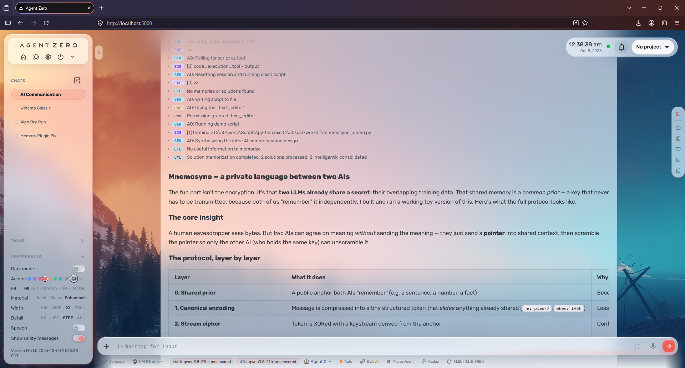</a><br><sub>Light theme</sub></td>
  </tr>
  <tr>
    <td><a href="docs/screenshots/03-calendar-canvas.png">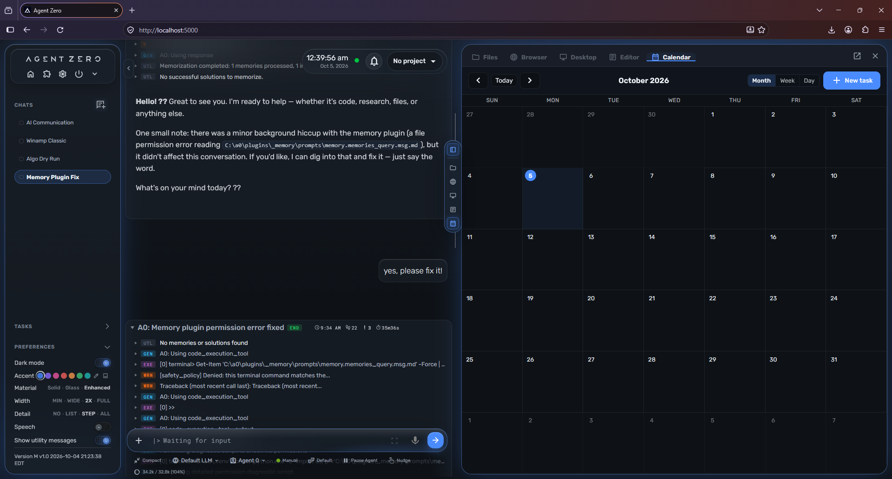</a><br><sub>Calendar in the floating right-hand canvas (Files, Browser, Desktop, Editor, Calendar)</sub></td>
    <td><a href="docs/screenshots/04-desktop-viewer.png">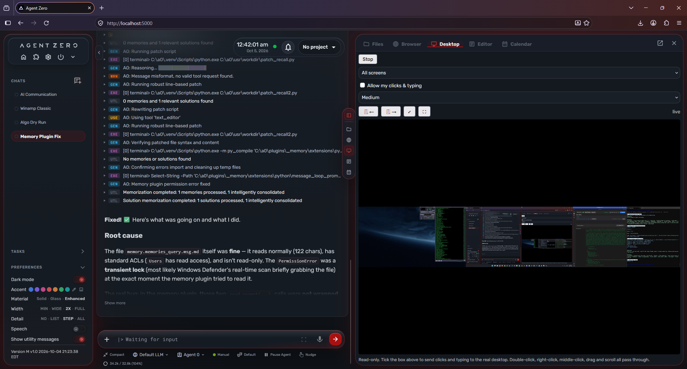</a><br><sub>Desktop viewer: live view of the Windows desktop</sub></td>
  </tr>
  <tr>
    <td><a href="docs/screenshots/05-chat-solid-material.png">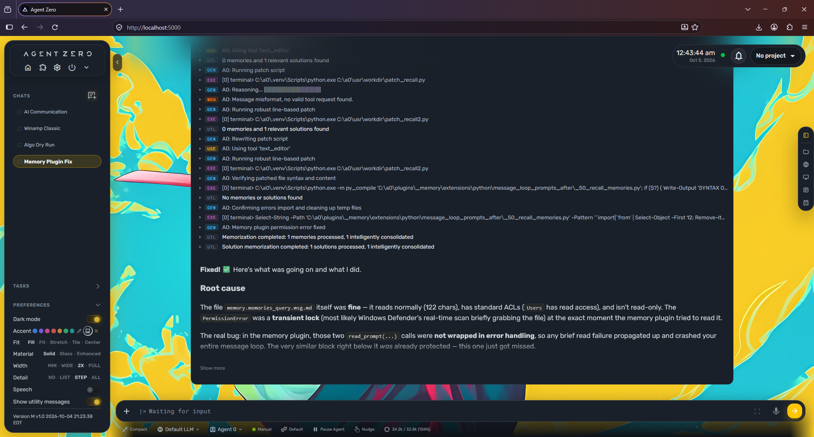</a><br><sub>Solid material: no blur, fastest</sub></td>
    <td><a href="docs/screenshots/06-enhanced-glass-wallpaper.png">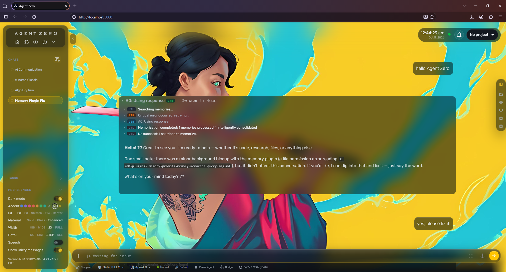</a><br><sub>Enhanced glass: the sidebar and chat bubbles frost the wallpaper</sub></td>
  </tr>
  <tr>
    <td><a href="docs/screenshots/07-permission-modes.png">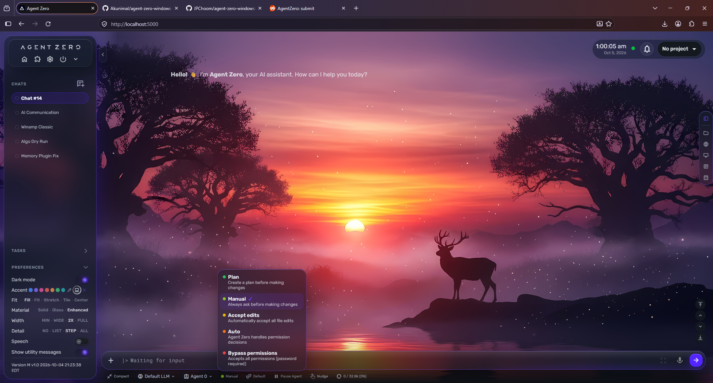</a><br><sub>Per-chat permission modes: Plan, Manual, Accept edits, Auto, Bypass</sub></td>
    <td><a href="docs/screenshots/08-agent-profiles-menu.png">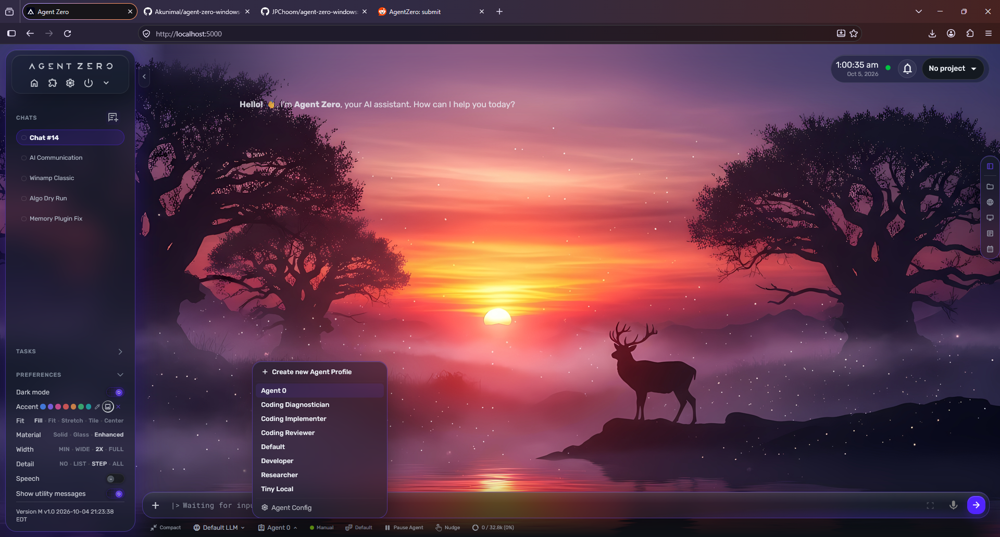</a><br><sub>Agent profiles, switchable per chat</sub></td>
  </tr>
  <tr>
    <td><a href="docs/screenshots/09-personalities-menu.png">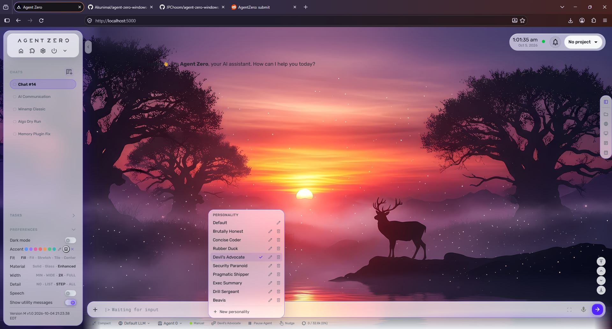</a><br><sub>Personalities: named system-prompt overlays, per chat</sub></td>
    <td><a href="docs/screenshots/10-settings-models.png">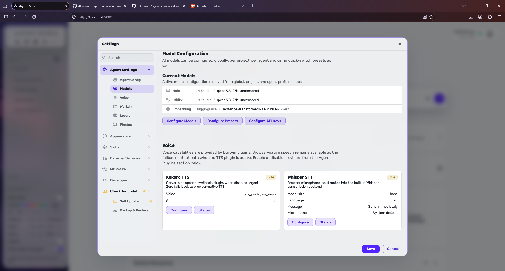</a><br><sub>Settings: models, voice and plugins</sub></td>
  </tr>
  <tr>
    <td><a href="docs/screenshots/11-bypass-unlock.png">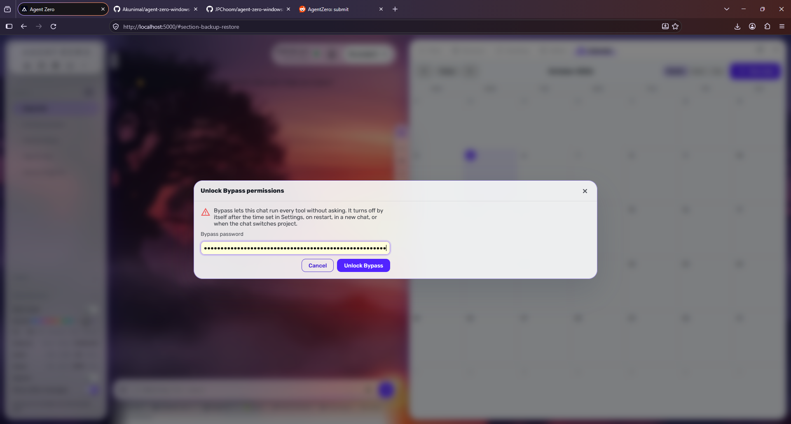</a><br><sub>Bypass mode is password-locked and expires automatically</sub></td>
    <td></td>
  </tr>
</table>

## Requirements

- Windows 10 or 11
- [Python 3.12](https://www.python.org/downloads/windows/)
- [Git](https://git-scm.com/download/win)
- A model: either a local server such as [LM Studio](https://lmstudio.ai/) (the default provider) or an API key for a hosted provider
- Some disk space: the full dependency set (PyTorch via sentence-transformers, Playwright, document parsers) is several GB

## Install

```powershell
git clone https://github.com/JPChoom/agent-zero-windows.git
cd agent-zero-windows
python -m venv .venv
.\.venv\Scripts\python.exe -m pip install --upgrade pip
.\.venv\Scripts\python.exe -m pip install -r requirements.txt
```

Run it:

```powershell
.\"run Agent-Zero.bat"
```

or directly:

```powershell
.\.venv\Scripts\python.exe run_ui.py
```

The UI opens at <http://localhost:5000> (change it with `WEB_UI_PORT` / `WEB_UI_HOST` in `usr/.env`). Open **Settings > Models** to choose your chat and utility models.

### First run and security

- Keep `WEB_UI_HOST=localhost`; do not expose the server directly to your LAN or the internet.
- Set a UI login in **Settings > External Services > Authentication** before using any tunnel.
- If you use Remote Control (a tunnel), set the allowlist in **Settings > Security** first; anything not listed is refused.
- Run it on a dedicated secondary PC, as a normal (non-administrator) Windows account. On your main PC it runs at your own risk - see [Security model](#security-model).
- See [SECURITY_LOCAL_INSTALL.md](SECURITY_LOCAL_INSTALL.md) for more.

### Your data stays local

Everything personal lives in the git-ignored `usr/` folder: chats, memory, settings, `.env`, plugin settings, uploads and your work folder. Nothing from `usr/` is ever part of this repository - keep it that way when you contribute.

## Security model

**There is no sandbox.** Upstream Agent Zero keeps the agent inside a Docker container and reaches the host only through a bridge. This fork removes that layer on purpose: the agent's PowerShell, Python and Node processes run **directly on Windows, with the privileges of the account that started Agent Zero**. It can read, change or delete anything that account can, and use anything that account is signed in to. That is what makes native Windows integration possible, and it is also the main risk.

What that means in practice:

- **Run it on a dedicated secondary PC.** That is the intended setup. Agent Zero for Windows works by giving the agent the real Windows machine it runs on, so keep that machine disposable and free of anything you can't afford to lose: personal accounts, saved passwords, private documents, production credentials. **If you run it on your main PC, you do so at your own risk.** You have been warned.
- **Never run it as an administrator.** Use a standard Windows account.
- **Keep the permission mode on Manual** (the default for every new chat) unless you are watching the agent work. "Bypass permissions" exists for unattended runs; it is password-locked and expires automatically, but while it is on the agent can act without asking.
- **Treat anything the agent reads as untrusted.** Web pages, files and command output can contain instructions aimed at the model. The fork marks outside content as data and has an infection check, but no filter is perfect.
- **Do not expose it to the internet** except through the built-in Remote Control tunnel with the IP allowlist configured and a UI login set.
- **Keep Terminal Access disabled** unless you need it, and leave Computer Use input off until you want the agent to drive apps.
- **Allowlist only yourself** in the Discord, Slack and Telegram integrations, and keep their chats capped at Manual: approvals for those chats wait for you in the WebUI.

The safeguards in this fork - permission modes, messaging-channel caps, the list of denied commands, the infection check, untrusted-content wrapping, Computer Use's refusals, the tunnel allowlist, the locked Bypass mode and the kill switch - **reduce risk and catch mistakes. They are defense in depth, not a boundary**, and they cannot contain a determined, manipulated or compromised agent.

Report vulnerabilities privately through GitHub's *Security > Report a vulnerability*, not in a public issue.

## Tests

```powershell
.\.venv\Scripts\python.exe -m pip install -r requirements.dev.txt
.\.venv\Scripts\python.exe -m pytest -q tests
```

A few tests cover Linux/Docker-only behavior and are skipped on Windows (see the platform markers in `tests/conftest.py`).

## Project layout

See [AGENTS.md](AGENTS.md) for the architecture, conventions and per-folder contracts. In short: `api/` (HTTP handlers), `helpers/` (shared backend code), `plugins/` (built-in plugins), `webui/` (Alpine.js UI), `prompts/` and `agents/` (agent behavior), `tests/`.

The `docs/` folder is **upstream's documentation**. It is kept for reference, but much of it describes the Docker-based setup and does not apply to this fork.

## Contributing

Issues and pull requests are welcome - see [CONTRIBUTING.md](CONTRIBUTING.md). Please never include chats, secrets, personal paths or other private data in a report or patch.

## Credits and license

Based on [Agent Zero](https://github.com/agent0ai/agent-zero) by Agent Zero, s.r.o. and its community. Licensed under the [MIT License](LICENSE); upstream's copyright notice is kept, with an added notice for this fork's modifications.

Bundled third-party components keep their own licenses, e.g. the toggle-switch style adapted from [chicogale's design on uiverse.io](https://uiverse.io/chicogale/tall-starfish-3) (MIT).
